  

# Ing. Alcibiades Lopez

---

  

## `$ cat tech-stack.yaml`

<table border="1" cellpadding="14" bgcolor="#17171c">
  <thead>
    <tr>
      <th colspan="2" align="left"><code>alssylop:~$ cat tech-stack.yaml</code></th>
    </tr>
  </thead>
  <tbody>
    <tr>
      <td width="50%" valign="top"><code>├─ ☕ backend_core:</code>  
         
        <code>Java · Spring Boot · Python · FastAPI · C#</code>
      </td>
      <td width="50%" valign="top"><code>├─ 🌐 frontend_web:</code>  
         
        <code>TypeScript · JavaScript · Next.js · Node.js</code>
      </td>
    </tr>
    <tr>
      <td valign="top"><code>├─ ▣ databases_storage:</code>  
         
        <code>PostgreSQL · SQL Server · MongoDB · MySQL</code>
      </td>
      <td valign="top"><code>├─ ☁ cloud_devops:</code>  
         
        <code>AWS · Docker · Git · GitHub Actions</code>
      </td>
    </tr>
    <tr>
      <td valign="top"><code>├─ 🛠 developer_tools:</code>  
         
        <code>VS Code · Visual Studio · Postman · DBeaver · SSMS</code>
      </td>
      <td valign="top"><code>╰─ ⚡ workflow_ai:</code>  
        
        
        
         
        <code>Gemini · Claude Code · OpenCode · SonarQube · Warp</code>
      </td>
    </tr>
  </tbody>
  <tfoot>
    <tr>
      <td colspan="2"><code>status: open_to_work&nbsp;&nbsp;·&nbsp;&nbsp;location: colombia [utc-5]</code></td>
    </tr>
  </tfoot>
</table>

---

## GitHub Stats

  

---

### Contacto

 

   

